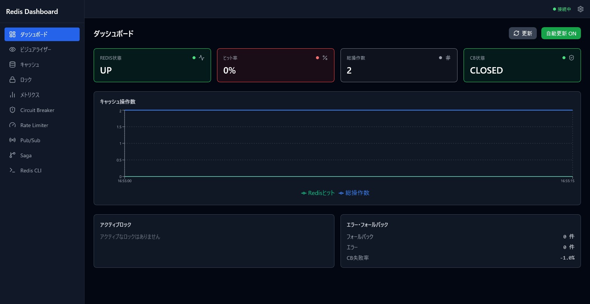
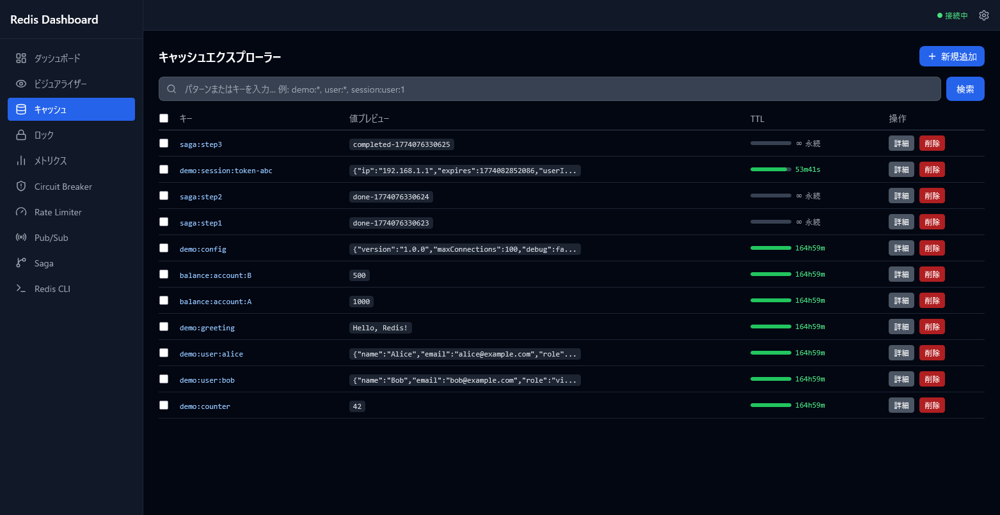
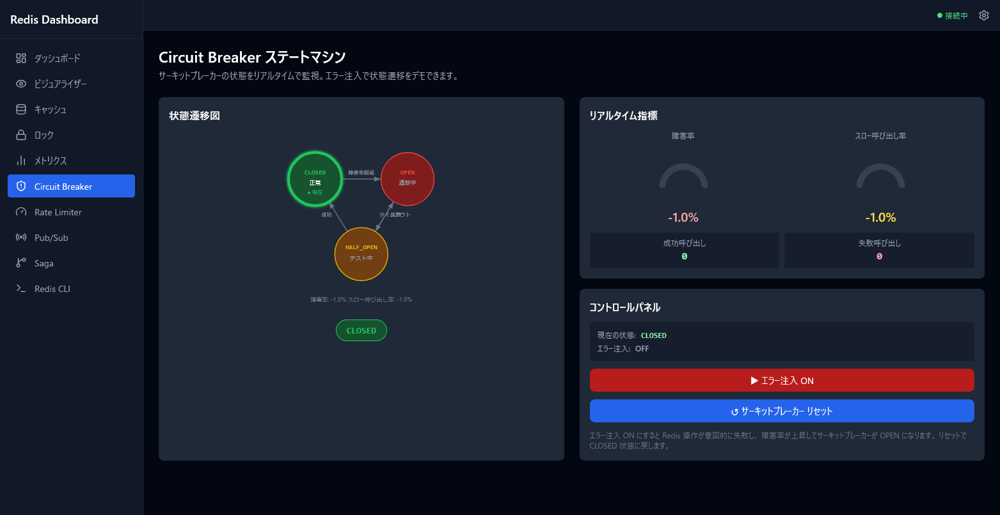
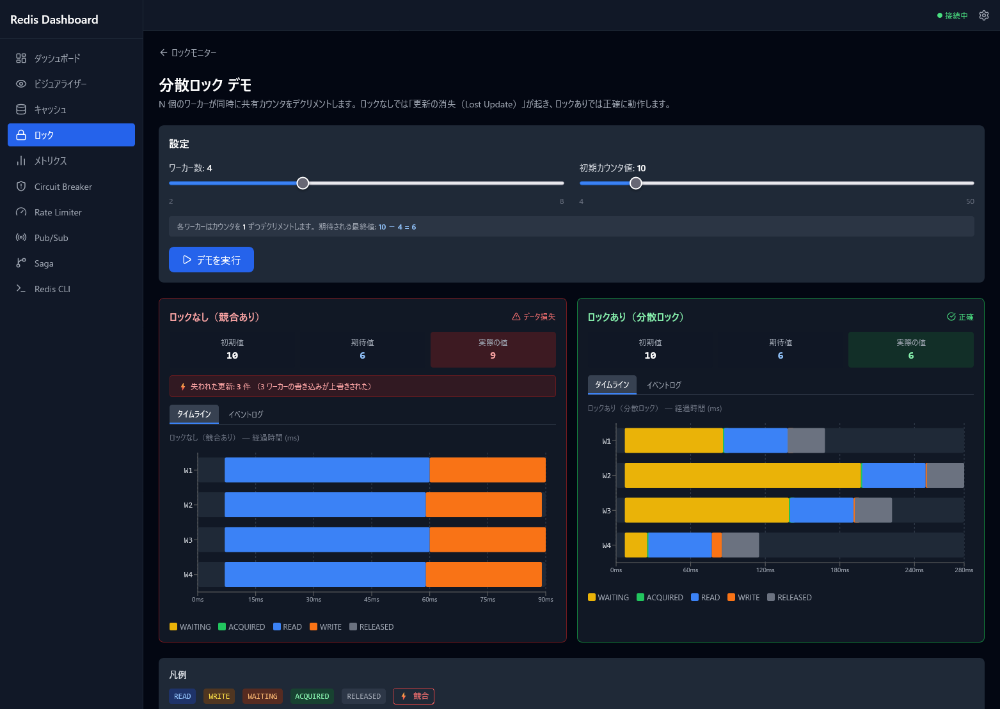
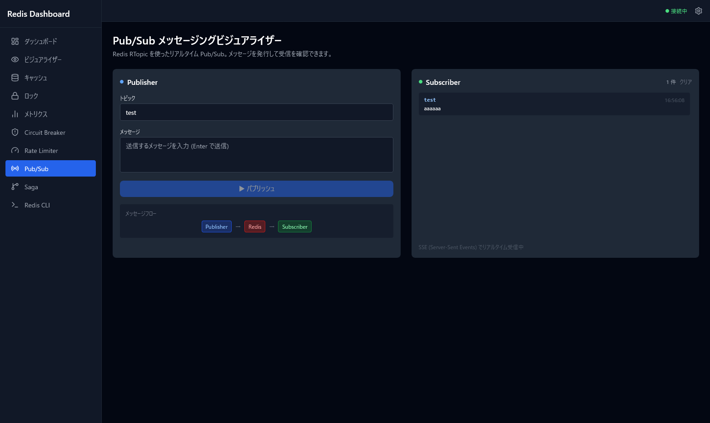
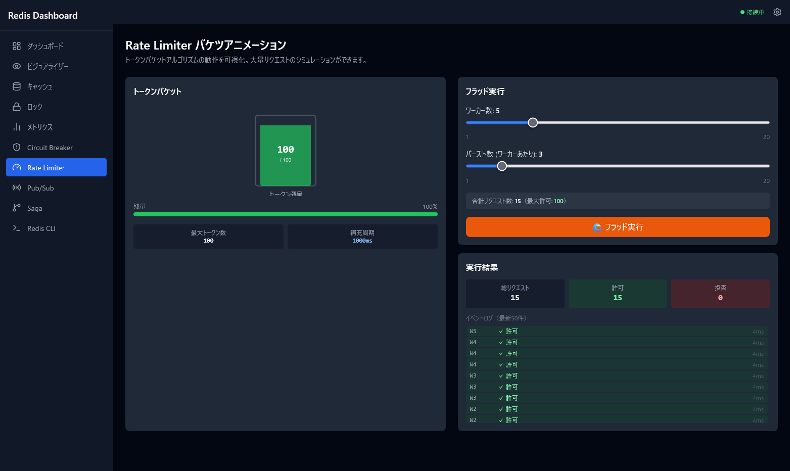

# Redis / Valkey サンプルアプリケーション

Redis（および互換実装 Valkey）を使った分散システムパターンを
**実際に動かして・壊して・回復させる**ことができるデモアプリケーションです。

---

## 実装パターン

| パターン | 説明 |
|---------|------|
| **マルチレイヤキャッシュ** | Primary/Fallback の 2 層構成、バッチ取得、型認識読み込み |
| **Circuit Breaker** | 障害検知 → 遮断 → 自動回復（CLOSED/OPEN/HALF-OPEN） |
| **Retry** | 指数バックオフ付きリトライ（最大 3 回） |
| **Rate Limiter** | トークンバケット方式、フラッドシミュレーション |
| **分散ロック** | Reentrant / Fenced / Read-Write / Fair / Sharded / Spin |
| **トランザクション** | Redis MULTI/EXEC、楽観的ロック |
| **Saga / 補償** | 障害時の補償トランザクション（Compensating Transaction） |
| **Pub/Sub** | Redis RTopic + SSE でブラウザへリアルタイム配信 |

---

## アーキテクチャ

```
Browser (http://localhost/)
        │
        ▼  :80
  ┌─────────────┐
  │    Nginx    │  静的ファイル配信 + /api/* /health をバックエンドへプロキシ
  └──────┬──────┘  ※ /api/pubsub/subscribe は SSE 用に buffering off
         │  :8080 (内部)
         ▼
  ┌────────────────────────────────────────┐
  │   Spring Boot 4.x / Java 21           │
  │   Redisson 4.x  ·  Resilience4j 2.x   │
  │   Micrometer + Prometheus              │
  └──────────────────┬─────────────────────┘
                     │  :6379 (内部)
                     ▼
  ┌─────────────────────────────┐
  │   Redis Alpine              │
  │   AOF 永続化 / オプション認証 │
  └─────────────────────────────┘
```

---

## 前提条件

| ツール | バージョン目安 |
|--------|--------------|
| Docker | 24.x 以上 |
| Docker Compose | v2.x 以上 |

> Java・Node.js・Gradle はすべて Docker 内でビルドするため、ローカルへのインストールは不要です。

---

## クイックスタート

```bash
# 1. クローン
git clone <repository-url>
cd redis-app_s

# 2. 起動（初回はイメージビルドを含む）
docker compose up -d

# 3. ブラウザでアクセス
open http://localhost/
```

起動確認：

```bash
docker compose ps
# NAME                      STATUS
# redis-app_s-redis-1       Up (healthy)
# redis-app_s-backend-1     Up (healthy)
# redis-app_s-frontend-1    Up
```

Redis パスワードを設定して起動する場合：

```bash
REDIS_PASSWORD=yourpassword docker compose up -d
```

停止・データ削除：

```bash
docker compose down        # 停止（データ保持）
docker compose down -v     # 停止 + ボリューム削除
```

---

## 画面一覧

| URL | ページ名 | 説明 |
|-----|---------|------|
| `/` | ダッシュボード | Redis 状態・ヒット率・操作数・CB 状態のサマリー |
| `/visualizer` | ビジュアライザー | 全キーをツリー形式で可視化 |
| `/cache` | キャッシュエクスプローラー | キー一覧・TTL・検索・追加・削除・一括操作 |
| `/cache/:key` | キー詳細 | Hash / List / Set / ZSet / Object の型対応ビューワー |
| `/locks` | ロックモニター | ロック状態・メトリクス |
| `/locks/transfer` | 送金デモ | 分散ロック＋トランザクションによる残高移動 |
| `/locks/demo` | ロックデモ | ロックあり・なしの競合比較（タイムライン付き） |
| `/metrics` | メトリクス | キャッシュ統計・Circuit Breaker テーブル |
| `/circuit-breaker` | Circuit Breaker | 状態遷移図・エラー注入・リセット |
| `/rate-limiter` | Rate Limiter | トークンバケットアニメーション |
| `/pubsub` | Pub/Sub | メッセージ発行＋ SSE リアルタイム受信 |
| `/saga` | Saga トレーサー | Saga パターンのステップ実行フロー |
| `/cli` | Redis CLI | ホワイトリスト制御付きコマンド実行 |
| `/swagger-ui.html` | Swagger UI | 全 REST API のインタラクティブドキュメント |

### スクリーンショット

<!-- TODO: docker compose up 後にキャプチャを取得して配置 -->

| ダッシュボード | キャッシュエクスプローラー |
|:---:|:---:|
|  |  |

| Circuit Breaker | ロックデモ |
|:---:|:---:|
|  |  |

| Pub/Sub | Rate Limiter |
|:---:|:---:|
|  |  |

---

## デモデータ

起動時に `DataSeeder` が以下のキーを自動投入します。

| キー | 型 | 内容 | TTL |
|------|------|------|-----|
| `demo:greeting` | String | `"Hello, Redis!"` | 1 時間 |
| `demo:counter` | Integer | `42` | 永続 |
| `demo:user:alice` | Object | ユーザー情報 | 24 時間 |
| `demo:user:bob` | Object | ユーザー情報 | 24 時間 |
| `demo:config` | Object | アプリ設定 | 永続 |
| `demo:session:token-abc` | Object | セッション情報 | 30 分 |
| `demo:account:alice` | Integer | `1000`（送金デモ用） | 永続 |
| `demo:account:bob` | Integer | `1000`（送金デモ用） | 永続 |

---

## ドキュメント

| ドキュメント | 内容 |
|------------|------|
| [API リファレンス](docs/api-reference.md) | 全エンドポイントの仕様・curl 例・レスポンス形式 |
| [実装パターン解説](docs/patterns.md) | CB・分散ロック・Saga・Pub/Sub の内部動作とデモ手順 |
| [開発環境セットアップ](docs/development.md) | ローカルでのバックエンド・フロントエンド起動手順 |
| [テスト](docs/testing.md) | テスト戦略・実行コマンド・カバレッジ設定 |
| [運用・Docker 操作](docs/operations.md) | リビルド・ログ確認・データリセット・OTel 設定 |

---

## E2E テスト

Playwright を使った E2E テストが `e2e/` ディレクトリに含まれています。
Docker Compose でアプリを起動した状態で実行します。

```bash
# 1. アプリ起動（ヘルスチェック通過まで待機）
bash e2e/scripts/docker-up.sh

# 2. 依存パッケージインストール（初回のみ）
cd e2e && npm install && npx playwright install chromium

# 3. テスト実行
npm test                    # 全テスト
npm run test:smoke          # スモークテスト（API / Swagger）
npm run test:pages          # 画面テスト（全ページ）

# 4. レポート確認
npm run report

# 5. テスト後クリーンアップ
bash ../e2e/scripts/docker-down.sh   # プロジェクトルートから実行する場合
# または: cd .. && bash e2e/scripts/docker-down.sh
```

> `BASE_URL` 環境変数でアクセス先を変更できます（デフォルト: `http://localhost`）

---

## 技術スタック

**バックエンド**

| 技術 | バージョン |
|------|-----------|
| Spring Boot | 4.0.3 |
| Java | 21（Virtual Threads 有効） |
| Redisson | 4.2.0 |
| Resilience4j | 2.4.0 |
| springdoc-openapi | 3.0.2 |
| Gradle | 9.4.1 |

**フロントエンド**

| 技術 | バージョン |
|------|-----------|
| React | 19.2.4 |
| TypeScript | 5.9.3 |
| Vite | 8.0.1 |
| Vitest | 4.1.0 |
| Tailwind CSS | 3.4.19 |
| Recharts | 3.8.0 |
